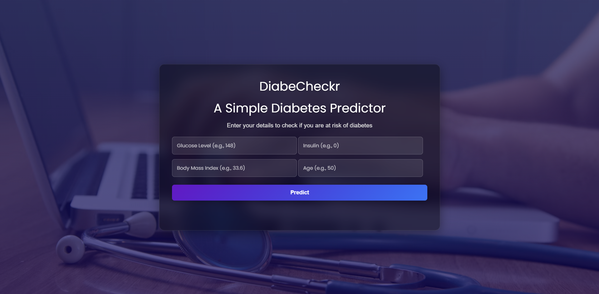

# Expanded the content under "About diabetes project.ipynb" to add more details to each step

detailed_readme_content = """
# DiabeCheckr – A Simple Diabetes Predictor 

**DiabeCheckr** is a beginner-friendly web application built using **Flask** that predicts whether a person is diabetic or not based on medical input. The prediction is powered by a **Random Forest Classifier** trained on the PIMA Indian Diabetes dataset.

---

## Web App Preview



---

### About the Model

- **Model**: Random Forest Classifier  
- **Trained on**: PIMA Indians Diabetes dataset  
- **Accuracy**: ~82%  
- **Features used**: Glucose, Insulin, BMI, Age  
- **Serialization**: `pickle` → `model.pkl`

---

### About `diabetes project.ipynb`

This Jupyter notebook contains the full data science workflow for building the diabetes prediction model used in the web app. The main steps include:

- **Data Loading & Exploration:**  
  - Loads the PIMA Indians Diabetes dataset (`diabetes.csv`) using `pandas`.
  
  - Analyzes the class distribution to check for imbalance in the target variable.
  - Identifies possible data quality issues such as 0 values in columns like `Glucose`, `BMI`, `BloodPressure`, etc.

- **Data Visualization:**  
  - Uses Seaborn and Matplotlib for comprehensive data visualization.
  - Plots feature distributions using histograms and KDE plots.
  - Analyzes correlations between features with a heatmap.
  - Creates box plots to detect outliers.
  - Visualizes how features differ between diabetic and non-diabetic patients using count plots and violin plots.

- **Data Cleaning & Preprocessing:**  
  - Replaces invalid zero values in key columns (e.g., `Glucose`, `BloodPressure`, `BMI`, `Insulin`) with NaN.
  - Fills missing values using median imputation to maintain robustness against outliers.
  - Applies `StandardScaler` for normalization to ensure fair model training across features.
  - Performs train-test split using an 80:20 ratio for unbiased evaluation.

- **Model Building:**  
  - Tests and compares multiple models: Logistic Regression, Random Forest, and K-Nearest Neighbors (KNN).
  - Focuses on Random Forest Classifier for deployment due to its balance of accuracy and generalization.
  - Selects important features such as `Glucose`, `Insulin`, `BMI`, and `Age` based on domain knowledge and correlation analysis.
  - Fine-tunes the model using `random_state` for reproducibility.

- **Model Evaluation:**  
  The notebook evaluates three machine learning models on the test data:

  #### Logistic Regression
  - **Test Accuracy:** 88.31%
  - **Precision, Recall, F1-score (Test set):**
    - No Diabetes (0): Precision 0.95, Recall 0.88, F1-score 0.91
    - Diabetes (1): Precision 0.76, Recall 0.89, F1-score 0.82


  #### Random Forest Classifier
  - **Test Accuracy:** 88.96%
  - **Precision, Recall, F1-score (Test set):**
    - No Diabetes (0): Precision 0.93, Recall 0.91, F1-score 0.92
    - Diabetes (1): Precision 0.80, Recall 0.85, F1-score 0.82


  #### K-Nearest Neighbors (KNN, k=10)
  - **Test Accuracy:** 88.96%
  - **Precision, Recall, F1-score (Test set):**
    - No Diabetes (0): Precision 0.92, Recall 0.92, F1-score 0.92
    - Diabetes (1): Precision 0.81, Recall 0.83, F1-score 0.82
    

  All metrics are calculated on the test set, providing a fair comparison of model performance.  
  Random Forest and KNN achieved the highest test accuracy (88.96%), with Logistic Regression close behind.

- **Model Serialization:**  
  Saves the trained Random Forest model using Python's `pickle` module as `model.pkl`, which is loaded in the Flask app during inference.

You can open this notebook in Jupyter to see the full code, visualizations, and step-by-step explanations.

---

### How to Run Locally

#### 1. Clone the Repository

```bash
git clone https://github.com/harrishsrinivasan/DiabeCheckr---A-Diabetes-Prediction-App-using-Machine-Learning.git
cd DiabeCheckr


###### Project Structure
```txt
├── DiabeCheckr/            # Flask web app (UI, routes, ML model)
│   ├── static/
│   │   └── style.css
│   ├── templates/
│   │   └── index.html
│   ├── app.py
│   ├── model.pkl
│
├── diabetes project.ipynb  # Model building & training
├── diabetes.csv            # Dataset used
├── preview.png             # Web app preview screenshot
└── README.md               # You're reading it!
```

---

